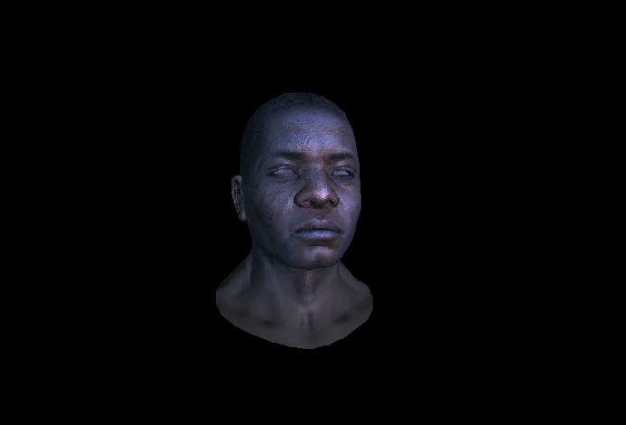

# Model Viewer

Software Model Viewer for Windows Platform

### Used features:

- Custom Multithreading
- Z-Buffer algorithm
- Phong shading algorithm
- Backface culling algorithm
- Normals interpolation
- Normals transformation
- Diffuse mapping, normal mapping, specular mapping